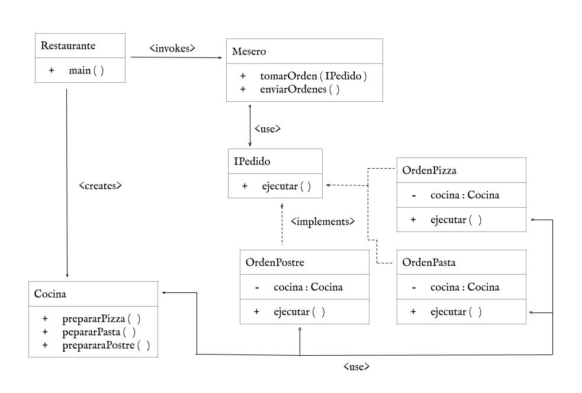

# Implementación del Patrón Command

## Descripción del Patrón
El patrón **Command** es utilizado para encapsular solicitudes como un objeto, permitiendo su parametrización y ejecución diferida. Este proyecto demuestra su implementación mediante un ejemplo práctico en **Java** utilizando **Maven** como gestor de dependencias.

---

## Estructura del Proyecto
La estructura del proyecto sigue el estándar de **Maven**:

```
DAYS-CommandProject
├── pom.xml                          # Archivo de configuración de Maven
├── README.md                        # Documentación del proyecto
└── src
    ├── main
    │   ├── java
    │   │   └── com
    │   │       └── mycompany
    │   │           └── days
    │   │               └── commandproject    # Código fuente principal
    │   │                   ├── Cocina.java
    │   │                   ├── Colores.java
    │   │                   ├── IPedido.java
    │   │                   ├── Mesero.java
    │   │                   ├── OrdenPasta.java
    │   │                   ├── OrdenPizza.java
    │   │                   ├── OrdenPostre.java
    │   │                   └── Restaurante.java
    │   └── resources               # Recursos adicionales
    └── test
        └── java                    # Pruebas unitarias

```

---

## Dependencias Utilizadas
Este proyecto utiliza las siguientes dependencias definidas en el archivo **pom.xml**:
```xml
<dependencies>
    <!-- Dependencias estándar de Maven -->
    <dependency>
        <groupId>com.mycompany</groupId>
        <artifactId>DAYS-CommandProject</artifactId>
        <version>1.0-SNAPSHO</version>
        <scope>compile</scope>
    </dependency>
</dependencies>
```

---

## Instrucciones de Instalación

1. **Clonar el repositorio:**
```bash
git clone https://github.com/JorEstDiBe/DAYS-Command.git
cd DAYS-Command
```

2. **Compilar el proyecto:**
```bash
mvn clean compile
```

3. **Ejecutar el proyecto:**
```bash
mvn compile exec:java -Dexec.mainClass="com.mycompany.days.commandproject.DAYSCommandProject"
```

---

## Ejemplo de Ejecución
Al ejecutar el programa, deberías ver la siguiente salida:
```
[Mesero] ? Tomando pedido...
[Mesero] ? Tomando pedido...
[Mesero] ? Tomando pedido...
[Mesero] ? Enviando pedidos a la cocina...
[Mesero] ? Orden de Pizza recibida.
[Cocina] ? Preparando pizza deliciosa...
[Mesero] ? Orden de Pasta recibida.
[Cocina] ? Cocinando pasta al dente...
[Mesero] ? Orden de Postre recibida.
[Cocina] ? Preparando un dulce postre...

```

---

## Diagrama UML
El siguiente diagrama muestra la estructura del patrón implementado:



---

## Explicación de la Implementación
El patrón **Command** ha sido implementado utilizando las siguientes clases principales:
- **[IPedido] (interfaz)**: Define el método que deberán implementar todas las órdenes concretas (commands).
- **[OrdenPizza]**: Implementa la orden de preparar pizza.
- **[OrdenPasta]**: Implementa la orden de preparar pasta.
- **[OrdenPostre]**: Implementa la orden de preparar un postre.
- **[Cocina] (receiver)**: Contiene la lógica para “preparar” cada plato.
- **[Mesero] (invoker)**: Recibe las órdenes (commands) y decide cuándo ejecutarlos.
---

## Contribuciones
Este proyecto fue desarrollado por:
- Laura Camila Rodriguez León
- Jorge Esteban Diaz Bernal
- Juan Diego Martinez Escobar

